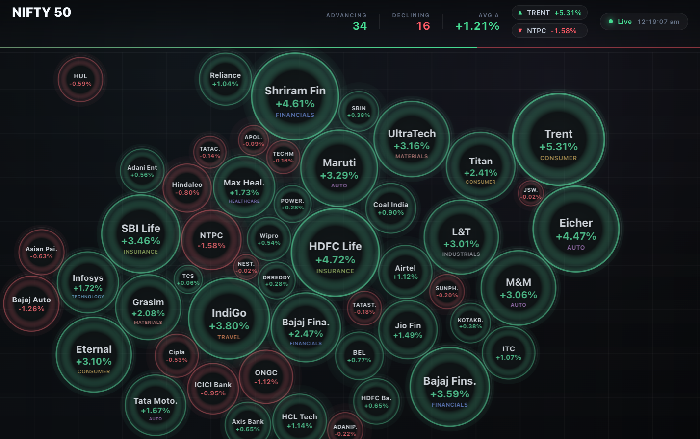

# NIFTY 50 Bubble Map

Interactive market map for the NIFTY 50. Stocks are shown as animated bubbles that scale by movement and color by intraday performance, with hover details, market breadth, top gainer/loser chips, and live-status feedback.



## Features

- Full-screen canvas visualization for NIFTY 50 stocks
- Live WebSocket updates through a Cloudflare Durable Object
- Demo-mode fallback when live market data is unavailable
- Bubble size, color, and motion driven by stock performance
- Hover lens for price, day range, volume, and symbol details
- Responsive dark interface for desktop and mobile

## Tech Stack

- [Astro](https://astro.build/)
- Cloudflare Workers
- Cloudflare Durable Objects
- TypeScript
- Bun

## Getting Started

Install dependencies:

```sh
bun install
```

Start the local development server:

```sh
bun dev
```

Build for production:

```sh
bun build
```

Preview the production build locally:

```sh
bun preview
```

## Deployment

The project is configured for Cloudflare Workers in `wrangler.jsonc`. To build and deploy:

```sh
bun run deploy
```

Generate Cloudflare environment types after changing bindings:

```sh
bun run generate-types
```

## Project Layout

```text
src/pages/index.astro   Main canvas UI and client-side interaction
src/worker.ts           Cloudflare Worker, routing, and stock WebSocket room
public/image.png        UI screenshot used in this README
wrangler.jsonc          Cloudflare Worker and Durable Object configuration
```
